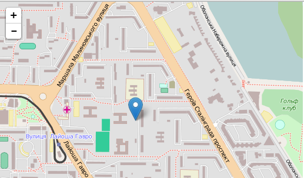

Leaflet API
==========================
> 主站：http://leafletjs.com/   
> 翻译：wlhmyit@126.com  

+ 中文
+ 便捷
+ API
+ 地图

### 一、简介   
在移动互联网时代，基于LBS的应用越来越重要，就像水电基础设施一样，成为必不可少的元素。国内BAT、国外Google、Apple、MS都有自己的地图，试图在地图基础设施上分一杯羹。微信的附近、美团的美食无不透露着LBS的影子，不管是否存在地图，背后都是map在作支撑。   
国内LBS比较突出的是高德地图、百度地图，功能也相对完善。国外开源地图库比较出名的有Leaflet、openlayer...这里，介绍的主要是轻量级的地图库Leatlet。   
### 二、理性感受  
+ Leaflet是开源的，尤其是移动端友好的地图库
+ 体积 33KB
+ 包含几乎所有的地图要素
+ 在现代浏览器中采用了HTML5 & CSS3的优势特性
+ 可基于此，扩展丰富的插件
+ 良好的文档 & 贡献源码

### 三、基础Demo体验   
	<!DOCTYPE html>
	<html style="width: 100%;height: 100%;">
	<head>
	    <meta charset="utf-8" />
	    <meta name="viewport" content="width=device-width, initial-scale=1.0">
	    <title>Leaflet初体验</title>
	    <link rel="stylesheet" href="http://cdn.leafletjs.com/leaflet-0.7.3/leaflet.css" />
	    
	</head>
	<body style="width: 100%;height: 100%;margin:0;">
	    

	    
	</body>
	</html>

+ DomEvent: <https://github.com/vczero/leaflet-cn/blob/master/Dom/DomEvent.md>